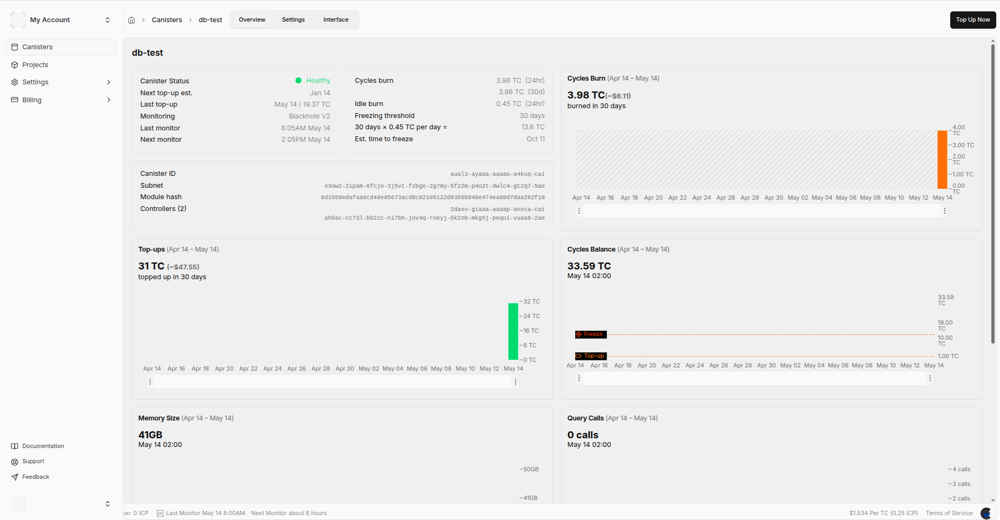

# Performance test results

The canister `aual3-ayaaa-aaaao-a4kuq-cai` was topped-up with 31 TC (~$47.55) and `insert_records` calls were made until it failed, resulting in a total of 2,561 records inserted.

```
$ dfx canister call test insert_records '(100)' --network ic
(2_561 : int)

$ dfx canister call test insert_records '(100)' --network ic
Error: Failed update call.
Caused by: The replica returned a rejection error: reject code CanisterError, reject message Error from Canister aual3-ayaaa-aaaao-a4kuq-cai: Canister cannot grow memory by 8388608 bytes due to insufficient cycles. At least 1_596_133_048 additional cycles are required..
Try topping up the canister. See documentation: https://internetcomputer.org/docs/current/references/execution-errors#insufficient-cycles-in-memory-grow, error code Some("IC0532")
```



```
$ dfx canister status test --network ic
Canister status call result for test.
Status: Running
Controllers: 2daxo-giaaa-aaaap-anvca-cai ah6ac-cc73l-bb2zc-ni7bh-jov4q-roeyj-6k2ob-mkg5j-pequi-vuaa6-2ae
Memory allocation: 0 Bytes
Compute allocation: 0 %
Freezing threshold: 2_592_000 Seconds
Idle cycles burned per day: 1_099_636_706_989 Cycles
Memory Size: 107_604_797_636 Bytes
Balance: 33_290_661_233_561 Cycles
Reserved: 0 Cycles
Reserved cycles limit: 5_000_000_000_000 Cycles
Wasm memory limit: 3_221_225_472 Bytes
Wasm memory threshold: 0 Bytes
Module hash: 0x8d3359edafaa0cd49e95673acd8c82105122d83b5b948e474ea89d7daa262f18
Number of queries: 0
Instructions spent in queries: 0
Total query request payload size: 0 Bytes
Total query response payload size: 0 Bytes
Log visibility: controllers
```

`get_record` calls were successful, which an average time of ~1.2 seconds.

$ dfx canister call test get_record '(1040)' --network ic
(
  "{\'_id\': \'ancbkobcjkgeobnbjoekjenpmkdkghmh\', \'name\': \'User 79\', \'email\': \'user79@example.com\', \'score\': 790, \'addresses\': [{\'_id\': \'addr_79_1_961\', \'street\': \'Street 79\', \'city\': \'City 4\'}], \'tags\': [{\'_id\': \'tag_79_0_961\', \'name\': \'Tag 0\'}, {\'_id\': \'tag_79_1_961\', \'name\': \'Tag 1\'}], \'favorite_tag\': {\'_id\': \'tag_fav_79_961\', \'name\': \'Tag 4\'}}",
)


